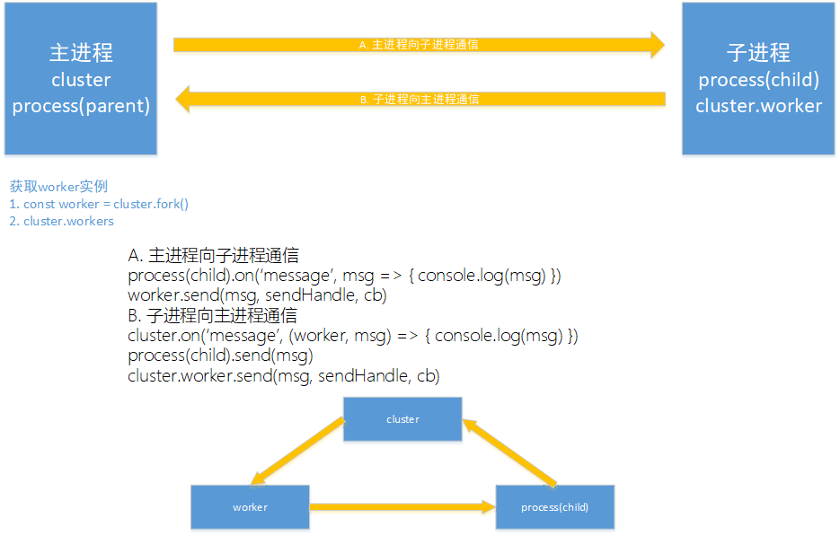

# Cluster集群学习

## 相关代码
[src](../src/cluster/main.ts)
## 结论
* 虽然平常通过设置为CPU进程数的工作进程，但是可以超过这个数，并且并不是主进程先创建
```javascript
if (cluster.isMaster) {
  // 循环 fork 任务 CPU i5-7300HQ 四核四进程
  for (let i = 0; i < 6; i++) {
    cluster.fork()
  }
  console.log(chalk.green(`主进程运行在${process.pid}`))
} else {
  app.listen(1314) // export app 一个 Koa 服务器的实例
  console.log(chalk.green(`子进程运行在${process.pid}`))
}
#子进程运行在17768
#子进程运行在5784
#子进程运行在11232
#子进程运行在7904
#主进程运行在12960
#子进程运行在4300
#子进程运行在16056
```
* 在主进程中 cluster 表示主进程(用于监听、发送事件), process 是本身的进程，worker 表示子进程，通过 cluster.workers 获取
* 在子进程中 process 表示子进程(用于监听、发送事件),也可以通过 cluster.worker 表示当前子进程
cluster.worker.process 等价于 process(在子进程中)


## 主进程子进程相互通信


* **cluster** 用于监听 process(child) 子进程触发的各种事件
* **worker** 只能在主进程中获取，用于和自身通信。当子进程触发事件时，会返回当前的 worker 以及相关的信息到主进程相应的事件中
* **process(parent)** 主进程本身的进程实例，在通信过程中基本没有用到
* **process(child)** 子进程本身的实例，只能在子进程获取用于监听自身的事件

可见主进程与子进程通过这样一个三角关系互相通信，其中 cluster 和 worker 是在主进程中获取的，process(child) 是子进程。 cluster 通过操作 worker 通知子进程，子进程本身和 cluster 进行通信。为什么要这样设计呢？因为子进程会有多个，只有通过 worker 才能选择和哪个进程通信

## 子进程的调度策略 cluster.schedulingPolicy

> 调度策略，包括循环计数的 cluster.SCHED_RR，以及由操作系统决定的cluster.SCHED_NONE。 这是一个全局设置，当第一个工作进程被衍生或者调动cluster.setupMaster()时，都将第一时间生效。除Windows外的所有操作系统中，SCHED_RR都是默认设置。只要libuv可以有效地分发IOCP handle，而不会导致严重的性能冲击的话，Windows系统也会更改为SCHED_RR。cluster.schedulingPolicy 可以通过设置NODE_CLUSTER_SCHED_POLICY环境变量来实现。这个环境变量的有效值包括"rr" 和 "none"。

RR 即 Round-Robin 轮询调度，即每个子进程的获取的事件的机会是均等的，这是除 windows以外默认的。而 windows 下的调度策略很诡异，见下图。目前并没有相关 API 可以设置调度策略的算法，node 只为我们提供了两个值


测试数据为 1000次 并发请求，重复测试20次，在windows下的表现情况。可见 windows 的调度算法表现的杂乱无章。如果是 RR 算法四条进程的调度应该处于同一横线上。暂时没在本地搭建 linux 环境，有条件的同学可以协助测试一波。
cluster的调度算法目前至于系统有关

## 多进程间的鉴权问题
> 注意：Node.js不支持路由逻辑。因此在设计应用时，不应该过分依赖内存数据对象（如sessions和login等）。由于各工作进程是独立的进程，它们可以根据需要随时关闭或重新生成，而不影响其他进程的正常运行。只要有存活的工作进程，服务器就可以继续处理连接。如果没有存活的工作进程，现有连接会丢失，新的连接也会被拒绝。Node.js不会自动管理工作进程的数量，而应该由具体的应用根据实际需要来管理进程池。

文档中已明确说明了，每一个工作进程都是独立的，并且互相之间除了能够进行通信外，没有办法共享内存。所以在设计鉴权的时候，有两种方法
1. 通过共有的主进程存储鉴权信息，每次前端提交帐号密码，授权完成后，将 token 发送给主进程，下次前台查询时先在主进程获取授权信息
2. 通过统一的外部 redis 存取

两种方法看来还是第二种好的不要太多，因此多进程的环境下，应该使用外部数据库统一存储 token 信息

## 进一步的子进程间通信思考
虽然 node 中并没有直接提供的进程间通讯功能，但是我们可以通过主进程相互协调进程间的通讯功能，需要定义标准的通信格式，例如
```typescript
interface cmd {
  type: string
  from: number
  to: number
  msg: any
}
```
这样通过统一的格式，主进程就可以识别来自各个进程间的通信，起到进程通信中枢的功能

## [egg.js](http://eggjs.org/) 中 agent 的实现
```
                +--------+          +-------+
                | Master |<-------->| Agent |
                +--------+          +-------+
                ^   ^    ^
               /    |     \
             /      |       \
           /        |         \
         v          v          v
+----------+   +----------+   +----------+
| Worker 1 |   | Worker 2 |   | Worker 3 |
+----------+   +----------+   +----------+
```
我们看到 egg 在多进程模型之间实现了一个 agent 进程，这个进程主要负责对整个系统的定期维护
> 说到这里，Node.js 多进程方案貌似已经成型，这也是我们早期线上使用的方案。但后来我们发现有些工作其实不需要每个 Worker 都去做，如果都做，一来是浪费资源，更重要的是可能会导致多进程间资源访问冲突。举个例子：生产环境的日志文件我们一般会按照日期进行归档，在单进程模型下这再简单不过了：

>每天凌晨 0 点，将当前日志文件按照日期进行重命名
>
>销毁以前的文件句柄，并创建新的日志文件继续写入


>试想如果现在是 4 个进程来做同样的事情，是不是就乱套了。所以，对于这一类后台运行的逻辑，我们希望将它们放到一个单独的进程上去执行，这个进程就叫 Agent Worker，简称 Agent。Agent 好比是 Master 给其他 Worker 请的一个『秘书』，它不对外提供服务，只给 App Worker 打工，专门处理一些公共事务。

这样我们可以指定一个进程作为 agent 进程，用于实现自己定义的事务。在 egg 中，主线程启动后 首先 fork agent进程，当 agent 进程启动完成后再启动具体的 worker 进程。参照上面的代码，相信这部分逻辑现在也不难实现了。这样 agent 就会获得 id 为1的进程

## 最后
P.S 勘误，图2中的线程应该为进程，独立的nodejs进程

本文相关代码在 [github](../src/cluster)